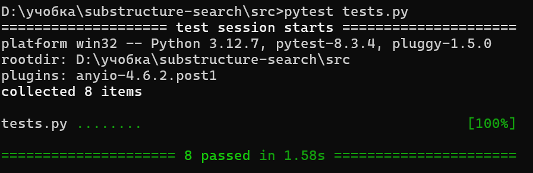

# Отчет по лабораторной работе №1
##### Тестирование ПО
###### Шевченко Кристина К3320


## 1. Анализ тестируемых функциональностей 
В ходе анализа приложения, предоставленного в проекте [substructure-search](https://github.com/krishevv/substructure-search), были выделены ключевые функциональные компоненты, которые требуют тестирования.

**Функциональные элементы** : 
1. **API для управления молекулами** :
  - Эндпоинты для добавления, обновления, удаления и получения молекул.

  - Обработка ошибок (например, если молекула с таким ID уже существует или не найдена).
 
2. **Поиск подструктур** : 
  - Эндпоинт для поиска подструктур в базе молекул. Работает с использованием библиотеки `RDKit` для поиска химических подструктур.
 
3. **Загрузка молекул через файл** : 
  - Эндпоинт для загрузки JSON-файлов с молекулами, где каждый объект содержит поля `id` и `smiles`. Проверка корректности формата файла.
**Критические части системы** : 
1. **Добавление и удаление молекул** :
  - Важно обеспечить корректную обработку данных при добавлении, удалении и обновлении молекул. Ошибки могут привести к неконсистентности хранилища молекул.
 
2. **Поиск подструктур** :
  - Поиск подструктур является центральной функциональностью приложения и должен быть протестирован на различных входных данных.
 
3. **Загрузка файлов с молекулами** :
  - Важно проверять правильность обработки файлов, их формат и корректность данных в файле.
**Важные случаи использования (use cases)** :
- Добавление молекул с уникальными и дублирующимися ID.

- Обновление молекул.

- Поиск подструктур с различными химическими строками SMILES.

- Загрузка файлов с молекулами и проверка на ошибки в формате.

## 2. Написание тестов 
**Тестируемые компоненты** :
Для тестирования были выбраны следующие функциональные части приложения:
 
- Эндпоинт для добавления молекул (`/add`).
 
- Эндпоинт для получения молекул (`/molecule/{id}`).
 
- Эндпоинт для обновления молекул (`/molecule/{id}`).
 
- Эндпоинт для удаления молекул (`/molecule/{id}`).
 
- Эндпоинт для поиска подструктуры (`/search`).
 
- Эндпоинт для загрузки файлов с молекулами (`/upload`).


**Написанные тесты** : 

1. **Тест на добавление молекулы** :

```python
def test_add_molecule():
    response = client.post("/add", json={"id": 1, "smiles": "CCO"})
    assert response.status_code == 200
    assert response.json() == {"message": "Молекула добавлена успешно.", "id": 1}
```
 
2. **Тест на получение молекулы** :

```python
def test_get_molecule():
    response = client.get("/molecule/1")
    assert response.status_code == 200
    assert response.json() == {"id": 1, "smiles": "CCO"}
```
 
3. **Тест на обновление молекулы** :

```python
def test_update_molecule():
    response = client.put("/molecule/1", json={"id": 1, "smiles": "CCC"})
    assert response.status_code == 200
    assert response.json() == {"message": "Молекула обновлена успешно.", "id": 1}
```
 
4. **Тест на удаление молекулы** :

```python
def test_delete_molecule():
    response = client.delete("/molecule/1")
    assert response.status_code == 200
    assert response.json() == {"message": "Молекула удалена успешно.", "id": 1}
```
 
5. **Тест на поиск подструктуры** :

```python
def test_search_substructure():
    client.post("/add", json={"id": 2, "smiles": "CCO"})
    response = client.post("/search", json={"substructure": "CO"})
    assert response.status_code == 200
    assert response.json()["matches"] == [{"id": 2, "smiles": "CCO"}]
```
 
6. **Тест на добавление дублирующейся молекулы** :

```python
def test_add_duplicate_molecule():
    client.post("/add", json={"id": 3, "smiles": "CCC"})
    response = client.post("/add", json={"id": 3, "smiles": "CCO"})
    assert response.status_code == 400
    assert response.json()["detail"] == "Молекула с таким ID уже существует."
```
 
7. **Тест на получение несуществующей молекулы** :

```python
def test_get_nonexistent_molecule():
    response = client.get("/molecule/999")
    assert response.status_code == 404
    assert response.json()["detail"] == "Молекула не найдена."
```
 
8. **Тест на загрузку молекул через файл** :

```python
def test_upload_molecules():
    data = json.dumps([{"id": 10, "smiles": "CCN"}, {"id": 11, "smiles": "OCC"}])
    files = {"file": ("molecules.json", BytesIO(data.encode()), "application/json")}
    response = client.post("/upload", files=files)
    assert response.status_code == 200
    assert response.json() == {"message": "Молекулы успешно загружены.", "count": 2}
```
Результат выполнения тестов:


**Принципы написания тестов** : 
- **AAA (Arrange, Act, Assert)** : Каждый тест состоит из трех частей: 
  - **Arrange** : Подготовка данных для теста.
 
  - **Act** : Выполнение тестируемой операции.
 
  - **Assert** : Проверка результатов.
 
- **FIRST (Fast, Isolated, Repeatable, Self-validating, Timely)** :
  - Тесты быстрые и изолированные (каждый тест выполняется в своем контексте).

  - Все тесты можно запускать повторно, и они не зависят от порядка выполнения.

  - Результаты тестов легко интерпретируются.

## 3. Результаты покрытия кода и выводы о качестве тестирования 
**Покрытие кода** :
Все ключевые функции API были покрыты тестами:

- Добавление, обновление и удаление молекул.

- Поиск подструктур.

- Загрузка молекул через файл.

Тесты охватывают основные случаи, включая ошибочные сценарии (например, дублирование ID или загрузка некорректного файла).


---
**Выводы** :
Тестирование показало, что приложение работает корректно в большинстве сценариев. Ошибки обработки данных (например, попытка добавить молекулу с уже существующим ID) правильно обрабатываются и возвращаются в виде сообщений об ошибке с соответствующим статусом HTTP.

Качество тестирования высокое, все функции работают как ожидалось, и приложения не имеет критических уязвимостей в основных сценариях использования.

