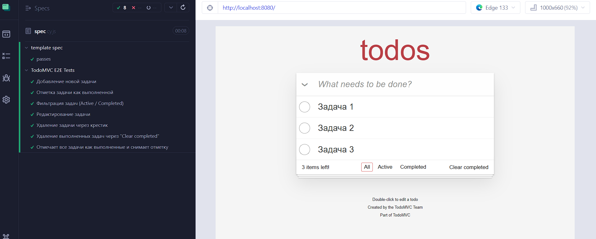

## **Отчёт по Лабораторной работе №3**
##### Тестирование ПО
##### Шевченко Кристина К3320

# **Выбранный проект**
  Для тестирования использовалось веб-приложение **TodoMVC** (https://github.com/tastejs/todomvc/)  , развернутое локально на `http://localhost:8080`.
# **Анализ пользовательских сценариев** 
Были выбраны основные пользовательские пути, которые критически важны для работы приложения:
 
1. **Добавление новой задачи**  – позволяет пользователю создавать новые задачи.
 
2. **Отметка задачи как выполненной**  – проверяет возможность завершения задач.
 
3. **Фильтрация задач**  – тестирует работу фильтров "Все", "Активные" и "Выполненные".
 
4. **Редактирование задачи**  – проверяет возможность изменения задачи после её добавления.
 
5. **Удаление задачи через крестик**  – важный сценарий для управления списком.
 
6. **Удаление завершённых задач (Clear Completed)**  – позволяет удалить сразу все выполненные задачи.
 
7. **Отметка всех задач как выполненных и обратно (Toggle All)**  – удобная массовая операция.
**Написание E2E тестов** Тесты были написаны с использованием **Cypress** .

## **Примеры тестов** 
#### **Добавление новой задачи** 

```javascript
it('Добавление новой задачи', () => {
  cy.get('.new-todo')
    .type('Купить молоко{enter}'); 

  cy.get('.todo-list li')
    .should('contain.text', 'Купить молоко');
});
```
 **Ожидание** : новая задача отображается в списке.
 
#### **Отметка задачи как выполненной** 

```javascript
it('Отметка задачи как выполненной', () => {
  cy.get('.new-todo')
    .type('Купить хлеб{enter}');

  cy.get('.todo-list li')
    .contains('Купить хлеб')
    .parent()
    .find('.toggle')
    .click(); 

  cy.get('.todo-list li.completed')
    .should('contain.text', 'Купить хлеб');
});
```
**Ожидание** : задача помечается как выполненная.
#### **Фильтрация задач** 

```javascript
it('Фильтрация задач (Active / Completed)', () => {
  cy.get('.new-todo').type('Сделать зарядку{enter}');
  cy.get('.new-todo').type('Приготовить обед{enter}');

  cy.get('.todo-list li')
    .contains('Сделать зарядку')
    .parent()
    .find('.toggle')
    .click(); 

  cy.get('.filters').contains('Active').click(); 
  cy.get('.todo-list li')
    .should('contain.text', 'Приготовить обед')
    .and('not.contain.text', 'Сделать зарядку');

  cy.get('.filters').contains('Completed').click(); 
  cy.get('.todo-list li')
    .should('contain.text', 'Сделать зарядку')
    .and('not.contain.text', 'Приготовить обед');

  cy.get('.filters').contains('All').click(); 
  cy.get('.todo-list li')
    .should('contain.text', 'Сделать зарядку')
    .and('contain.text', 'Приготовить обед');
});
```
 **Ожидание** : фильтры работают корректно.
 
#### **Редактирование задачи** 

```javascript
it('Редактирование задачи', () => {
  cy.get('.new-todo').type('Почитать книгу{enter}');

  cy.get('.todo-list li label')
    .contains('Почитать книгу')
    .dblclick({ force: true });

  cy.get('.todo-list li .input-container input')
    .should('be.visible')
    .clear()
    .type('Посмотреть фильм{enter}');

  cy.get('.todo-list li label').should('contain.text', 'Посмотреть фильм');
});
```
 **Ожидание** : текст задачи изменяется.
#### **Удаление задачи через крестик** 

```javascript
it('Удаление задачи через крестик', () => {
  cy.get('.new-todo').type('Купить молоко{enter}');

  cy.get('.todo-list li')
    .contains('Купить молоко')
    .parent()
    .find('.destroy')
    .click({ force: true });

  cy.get('.todo-list li').should('not.exist');
});
```
**Ожидание** : задача удаляется.

#### **Удаление всех выполненных задач (Clear Completed)** 

```javascript
it('Удаление выполненных задач через "Clear completed"', () => {
  cy.get('.new-todo').type('Выкинуть мусор{enter}');

  cy.get('.todo-list li')
    .contains('Выкинуть мусор')
    .parent()
    .find('.toggle')
    .click(); 

  cy.contains('Clear completed').click(); 

  cy.get('.todo-list li').should('not.exist');
});
```
 **Ожидание** : все выполненные задачи удаляются.
 
#### **Отметка всех задач как выполненных и обратно (Toggle All)** 

```javascript
it('Отмечает все задачи как выполненные и снимает отметку', () => {
  cy.get('.new-todo').type('Задача 1{enter}');
  cy.get('.new-todo').type('Задача 2{enter}');
  cy.get('.new-todo').type('Задача 3{enter}');

  cy.get('#toggle-all').click();
  cy.get('.todo-list li').should('have.class', 'completed');

  cy.get('#toggle-all').click();
  cy.get('.todo-list li').should('not.have.class', 'completed');
});
```
 **Ожидание** : массовая отметка задач работает.

---

## **Результаты тестирования** 


#### **Все тесты были успешно пройдены.** 

**Выявленные проблемы** : 
- **Фильтрация** : Cypress иногда выбирает не ту кнопку (`Toggle All` вместо `All`). Это решено явным указанием `.filters`.
 
- **Редактирование** : ввод в `input` не всегда корректно обрабатывается (исправлено `force: true`).

**Выводы**
 Приложение **TodoMVC**  прошло тестирование основных пользовательских сценариев. Все ключевые функции работают корректно. Возможные проблемы связаны с небольшими особенностями UI и CSS (например, скрытые элементы).
 
**Рекомендации по улучшению:**  
- Добавить `data-testid` к важным элементам для стабильности тестов.
 
- Улучшить работу фильтров, чтобы `All` всегда выбирался корректно.

- Улучшить UX редактирования (например, автофокус).